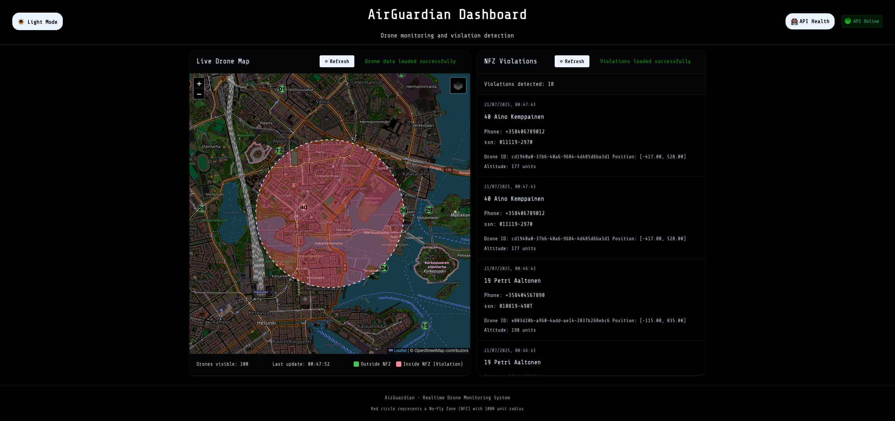
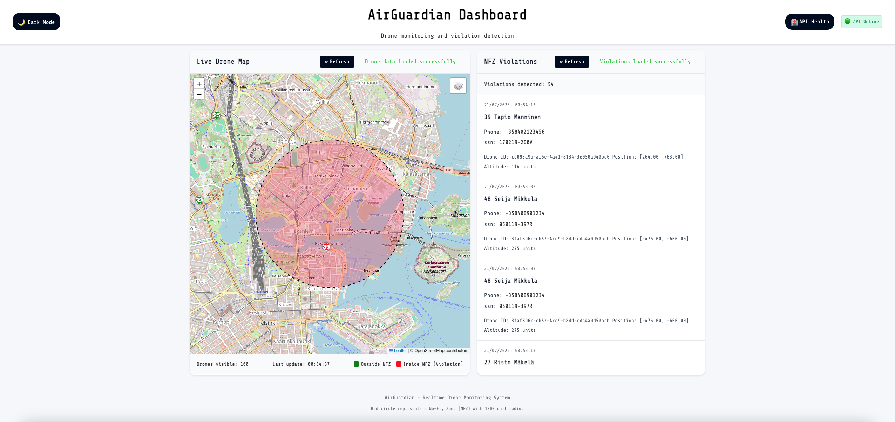

# AirGuardian Dashboard (Frontend)

This project is a simple and responsive web dashboard for visualizing and testing the [AirGuardian backend service](https://github.com/Aresga/FastAPI-Air-guardian), a drone surveillance system for monitoring and logging unauthorized drone activity in protected airspace.

---

## What This Project Does

The AirGuardian Dashboard provides a real-time, interactive interface for:
- Visualizing live drone positions and movements on a map
- Displaying recent No-Fly Zone (NFZ) violations with owner and drone details
- Monitoring backend API health and status
- Testing and verifying backend API endpoints in a user-friendly way

This dashboard is intended as a companion to the AirGuardian backend, making it easy to observe system behavior and validate backend functionality.

---

## Features

- **Prompt for API URL and API key**: localhost:8000 by default
- **Live Map Panel:** Visualizes drone positions and status in real time
- **Violations Panel:** Lists recent NFZ violations with details and timestamps
- **Dark Mode:** Toggleable for comfortable viewing
- **Status Indicators:** Shows backend API health and connection status
- **Custom Controls:** Refresh health check
- **Responsivnes:** Optimized for desktop and large screens

---

## File Structure

```
index.html      # Main HTML file for the dashboard
style.css       # Main stylesheet for layout and theming
map.css         # Additional styles for the map component
script.js       # JavaScript for interactivity and API integration
```

---

## Getting Started

1. **Clone the repository**
   ```sh
   git clone https://github.com/Aresga/aresga.github.io.git
   cd aresga.github.io
   ```

2. **Start the AirGuardian backend**
   - Follow the setup instructions in the [backend README](https://github.com/Aresga/FastAPI-Air-guardian#readme) to run the API locally (default: http://localhost:8000)

3. **Open `index.html` in your browser**
   - No build step is required.

---

## Backend Integration

This dashboard expects the AirGuardian backend API to be running and accessible (by default at `http://localhost:8000`).

### API Endpoints Used

- `GET /health` — Checks backend health status
- `GET /drones` — Fetches live drone data
- `GET /nfz` — Retrieves recent No-Fly Zone violation records (requires `X-Secret` header)

You may need to update the API base URL when prompted or authentication header in `script.js` if your backend is running on a different host or port.

---

## Customization

- **API URL endpoints:** Change the backend API enpoints in `script.js` if needed 
- **Map Data:** Adjust data handling in `script.js` to match your backend's response format
- **Styling:** Modify `style.css` and `map.css` for custom themes
- **Controls:** Add or remove dashboard controls in the HTML and update their logic in `script.js`

---

## Dependencies


- [Share Tech Mono](https://fonts.google.com/specimen/Share+Tech+Mono) and [Iceland](https://fonts.google.com/specimen/Iceland) via Google Fonts
- Map library Leaflet was used in `script.js`

---

## Screenshots





## Related Project

- [AirGuardian Backend (FastAPI)](https://github.com/Aresga/FastAPI-Air-guardian): The backend service for drone monitoring and violation detection

